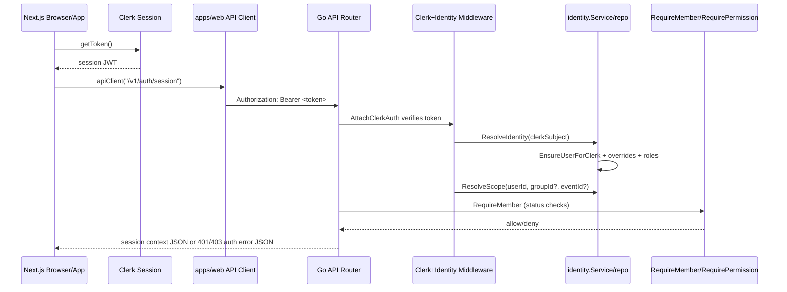

# E2E Auth + RBAC Code-Truth Map (Clerk + Go RBAC)

## Scope and repo reality
- Requested path `freediving.ph/services/fph-api-go` is not present in this workspace.
- Actual Go API path is `services/fphgo`.
- Requested frontend path `freediving.ph/app` is not present in this workspace.
- Actual frontend path is `apps/web`.
- Requested "Next.js 15" does not match current package version.
  - Evidence: `apps/web/package.json` symbol `dependencies.next`, lines `30-30` (`"next": "16.1.6"`).

## Frontend auth entrypoints (ClerkProvider, middleware, sign-in/out routes)
- `ClerkProvider` wraps entire app shell.
  - Evidence: `apps/web/src/app/layout.tsx` symbol `RootLayout`, lines `44-95`.
- Route protection middleware uses Clerk middleware + `auth.protect()`.
  - Evidence: `apps/web/src/middleware.ts` symbol default export from `clerkMiddleware`, lines `14-18`.
  - Evidence: `apps/web/src/middleware.ts` symbol `isProtectedRoute`, lines `3-12`.
- Sign-in page uses Clerk `<SignIn />`.
  - Evidence: `apps/web/src/app/sign-in/[[...sign-in]]/page.tsx` symbol `SignInPage`, lines `3-8`.
- Sign-up page uses Clerk `<SignUp />`.
  - Evidence: `apps/web/src/app/sign-up/[[...sign-up]]/page.tsx` symbol `SignUpPage`, lines `3-8`.
- Sign-out behavior uses Clerk `signOut()` in React Query hook.
  - Evidence: `apps/web/src/hooks/react-queries/auth.ts` symbol `useLogout`, lines `83-96`.

## Frontend token retrieval strategy (client-side vs server-side)
- Unified token retrieval now supports:
  - client-side: `window.Clerk.session.getToken()`
  - server-side: `auth().getToken()` from `@clerk/nextjs/server`
  - Evidence: `apps/web/src/lib/api/client.ts` symbol `getAuthToken`, lines `52-68`.
- Explicit server helper for API calls with Clerk server auth:
  - Evidence: `apps/web/src/lib/api/server.ts` symbol `apiServerClient`, lines `7-10`.
- Legacy axios request interceptor now consumes the same centralized token function:
  - Evidence: `apps/web/src/lib/http/helpers.ts` symbol `createAuthTokenInterceptor`, lines `6-17`.

## Frontend API calling strategy (where Authorization header is set)
- Primary fetch wrapper sets `Authorization: Bearer <token>` when token exists.
  - Evidence: `apps/web/src/lib/api/client.ts` symbol `apiClient`, lines `95-98`.
- React Query base query/fetcher pattern is centralized through `createApiQuery`.
  - Evidence: `apps/web/src/lib/api/query.ts` symbol `createApiQuery`, lines `3-6`.
- Auth/session hook now consumes `/v1/auth/session` via centralized fetcher.
  - Evidence: `apps/web/src/hooks/react-queries/auth.ts` symbol `useMe`, lines `19-25`.
- Existing axios feature clients still use one shared axios instance with auth interceptor.
  - Evidence: `apps/web/src/lib/http/axios.ts` symbol `axiosInstance`, lines `10-21`.

## Backend token verification flow (Clerk verification)
- Clerk middleware attached globally to API routes via `AttachClerkAuth`.
  - Evidence: `services/fphgo/internal/app/routes.go` symbol `NewRouter`, lines `47-49`.
- Clerk SDK HTTP auth middleware verifies bearer token using header authorization.
  - Evidence: `services/fphgo/internal/middleware/clerk_auth.go` symbol `AttachClerkAuth`, lines `27-43`.
- Post-verification claim checks enforce optional issuer and audience expectations.
  - Evidence: `services/fphgo/internal/middleware/clerk_auth.go` symbol `EnforceTokenClaims`, lines `81-107`.
  - Evidence: `services/fphgo/internal/app/routes.go` symbol `NewRouter` middleware chain, lines `48-50`.
- Optional local JWK verification path exists when `CLERK_JWT_KEY` provided.
  - Evidence: `services/fphgo/internal/middleware/clerk_auth.go` symbol `AttachClerkAuth`, lines `39-41`.
- Clerk secret key is loaded and set globally in API process.
  - Evidence: `services/fphgo/internal/config/config.go` symbol `Load`, lines `52-70`.
  - Evidence: `services/fphgo/cmd/api/main.go` symbol `main`, lines `27-29`.
- Invalid/expired bearer token now returns 401 + auth contract payload.
  - Evidence: `services/fphgo/internal/middleware/clerk_auth.go` symbol `AttachClerkAuth` failure handler, lines `33-37`.

## Backend identity upsert/resolution flow (EnsureUserForClerk)
- Identity middleware resolves Clerk subject from context and hydrates identity/scope into request context.
  - Evidence: `services/fphgo/internal/middleware/clerk_auth.go` symbol `AttachIdentityContext`, lines `45-77`.
- Identity service executes EnsureUserForClerk first, then resolves role/status/overrides.
  - Evidence: `services/fphgo/internal/features/identity/service/service.go` symbol `ResolveIdentity`, lines `21-50`.
- Upsert logic is idempotent via DB `ON CONFLICT` for user/profile/overrides.
  - Evidence: `services/fphgo/internal/features/identity/repo/repo.go` symbol `EnsureUserForClerk`, lines `28-78`.
- Scope resolution reads active membership roles from `group_memberships` and `event_memberships`.
  - Evidence: `services/fphgo/internal/features/identity/repo/repo.go` symbol `GroupRole`, lines `98-111`.
  - Evidence: `services/fphgo/internal/features/identity/repo/repo.go` symbol `EventRole`, lines `113-126`.
- Scope resolution now accepts both URL params and query params (`groupId`, `eventId`).
  - Evidence: `services/fphgo/internal/middleware/clerk_auth.go` symbols `paramOrQuery`, `queryParam`, lines `183-192`.

## Backend authorization enforcement points (RequireMember, RequirePermission usage)
- `RequireMember` enforces:
  - unauthenticated -> 401 `UNAUTHENTICATED`
  - suspended -> 403 `SUSPENDED`
  - read_only + write method -> 403 `READ_ONLY`
  - Evidence: `services/fphgo/internal/middleware/clerk_auth.go` symbol `RequireMember`, lines `81-102`.
- `RequirePermission` enforces permission check with scoped fallback.
  - Evidence: `services/fphgo/internal/middleware/clerk_auth.go` symbol `RequirePermission`, lines `104-126`.
- Router-level protection hierarchy:
  - member-only: `/v1/auth/session` under `RequireMember`
  - content routes (`/v1/messages`, `/v1/chika`, `/ws`) under `RequirePermission(content.read)`
  - Evidence: `services/fphgo/internal/app/routes.go` symbol `NewRouter`, lines `52-60`.
- Chika write routes enforce `content.write`.
  - Evidence: `services/fphgo/internal/features/chika/http/routes.go` symbol `Routes`, lines `18-30`.
- Messaging write routes now enforce `content.write`.
  - Evidence: `services/fphgo/internal/features/messaging/http/routes.go` symbol `Routes`, lines `14-19`.

## Session context endpoint contract
- Implemented endpoint: `GET /v1/auth/session`.
  - Route evidence: `services/fphgo/internal/features/auth/http/routes.go` symbol `Routes`, lines `5-8`.
  - Handler evidence: `services/fphgo/internal/features/auth/http/handlers.go` symbol `GetSession`, lines `18-45`.
- Response shape includes:
  - `userId`, `clerkSubject`, `globalRole`, `accountStatus`, `permissions`, `scopes.group`, `scopes.event`
  - Evidence: `services/fphgo/internal/features/auth/http/dto.go` symbol `sessionResponse`, lines `18-25`.

## Existing "who am I" endpoint(s)
- Existing endpoint `GET /v1/users/me` exists and ensures local user from Clerk.
  - Evidence: `services/fphgo/internal/features/users/http/routes.go` symbol `Routes`, lines `14-18`.
  - Evidence: `services/fphgo/internal/features/users/http/handlers.go` symbol `GetMe`, lines `43-57`.
- It does not return RBAC permissions/scopes.
  - Evidence: `services/fphgo/internal/features/users/http/handlers.go` symbol `GetMe`, lines `50-57`.

## Full request sequence diagram

## Gaps, mismatches, and unproven assumptions
- Go config now exposes API base URL and Clerk claim expectations via env.
  - Evidence: `services/fphgo/internal/config/config.go` symbol `Config`, lines `9-20`.
  - Evidence: `services/fphgo/internal/config/config.go` symbol `Load`, lines `54-79`.
  - Evidence: `services/fphgo/.env.example`, lines `1-10`.
- `UNIMPLEMENTED`: explicit Clerk `aud` verification inside Clerk SDK options is not present; current audience check is post-verification middleware check against JWT claims.
  - Evidence: `services/fphgo/internal/middleware/clerk_auth.go` symbol `EnforceTokenClaims`, lines `97-102`.
- Frontend still contains legacy axios consumers and legacy `apiCall` compatibility wrapper. Token logic is centralized now, but transport is mixed (`fetch` + `axios`).
  - Evidence: `apps/web/src/lib/http/axios.ts` symbol `axiosInstance`, lines `10-21`.
  - Evidence: `apps/web/src/lib/api.ts` symbol `apiCall`, lines `11-23`.
- Route-level scoped role extraction depends on `groupId`/`eventId` naming. Routes not using those names will not populate scoped role context.
  - Evidence: `services/fphgo/internal/middleware/clerk_auth.go` symbol `AttachIdentityContext`, lines `65-66`.
